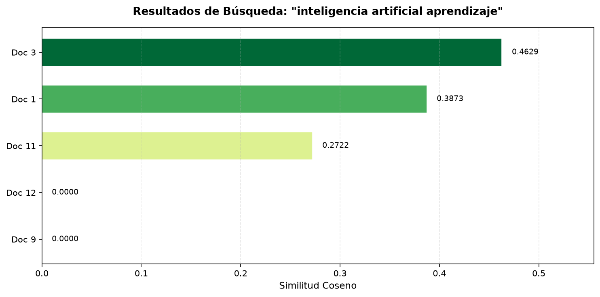
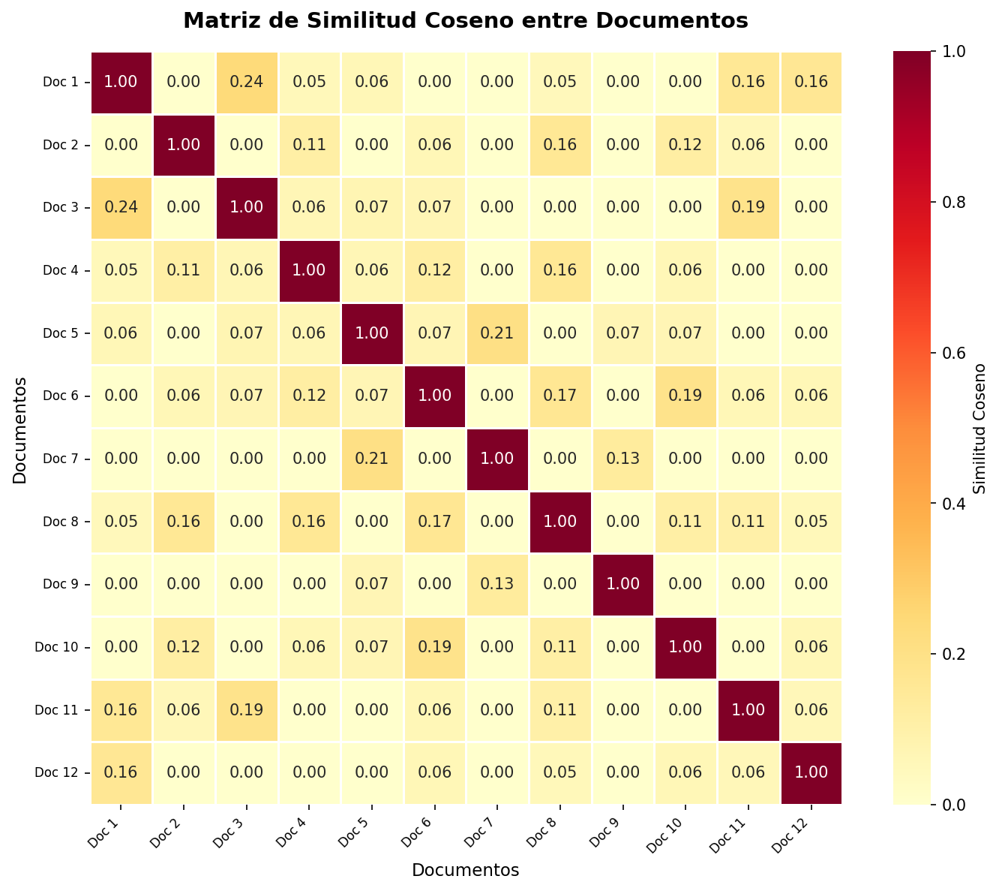
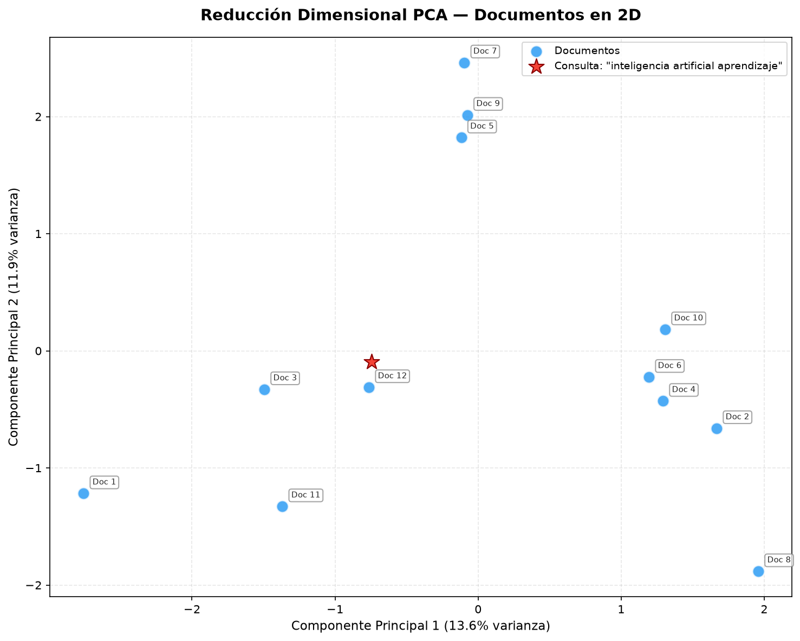
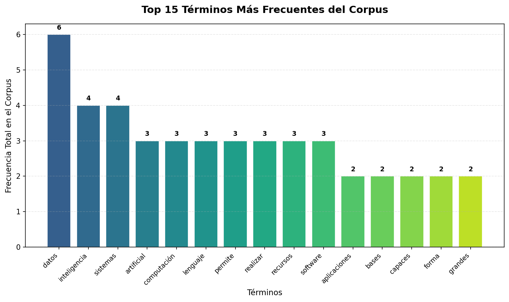

# Estructura Copiar/Pegar para Presentación (Prezi)
**Proyecto:** Buscador Semántico Simple utilizando Representación Vectorial de Texto

> 💡 **Instrucción:** El contenido bajo **"➡️ TEXTO PARA EL PPT"** es exactamente lo que debes copiar y pegar en la diapositiva visual. El contenido bajo **"🎙️ GUION DEL ORADOR"** es lo que cada integrante debe estudiar para hablar.

---

## 1. Introducción (RODRIGO)

**➡️ TEXTO PARA EL PPT:**
**¿Por qué un Buscador Semántico?**
- **Problema clásico:** Búsqueda exclusiva por palabras exactas.
- **La solución moderna:** Comprender la intención y el contexto.
- **El puente:** Uso del **Álgebra Lineal** para transformar textos en estructuras matemáticas calculables.

**🎙️ GUION DEL ORADOR (RODRIGO):**
"Los buscadores antiguos fallaban si no escribías la palabra exacta. Hoy buscamos que la computadora entienda el significado. En este proyecto construimos un motor desde cero usando álgebra lineal, demostrando cómo las matemáticas permiten que una máquina 'lea' y compare información."

---

## 2. Preprocesamiento y Vectorización (SEBA)

**➡️ TEXTO PARA EL PPT:**
**Modelo Bag-of-Words**
- **Transformación:** Lenguaje humano $\rightarrow$ Vectores numéricos.
- **Pipeline de Limpieza:** Minúsculas $\rightarrow$ Sin Puntuación $\rightarrow$ Tokenización $\rightarrow$ Filtro de Stopwords.
- **Espacio Vectorial:** Nuestro vocabulario único (154 palabras) define un espacio de alta dimensión ($\mathbb{R}^{154}$).

**🎙️ GUION DEL ORADOR (SEBA):**
"¿Cómo entiende la computadora el texto? Convirtiéndolo en números. Primero limpiamos el texto y extraemos las palabras útiles. Este vocabulario único define nuestro espacio matemático. Al tener 154 palabras, cada documento se convierte en un vector (una flecha) que vive en 154 dimensiones."

---

## 3. Matriz Documento-Término (SEBA)

**➡️ TEXTO PARA EL PPT:**
**La Matriz del Corpus**
- **Dimensiones:** 12 filas (Documentos) $\times$ 154 columnas (Términos).
- **Valores (TF):** Frecuencia de aparición de cada término en cada texto.
- **Concepto Clave:** Sparsidad (89.8% de la matriz son ceros).

**🎙️ GUION DEL ORADOR (SEBA):**
"Al agrupar los vectores obtenemos una matriz. Lo más interesante es la 'sparsidad'. Casi 9 de cada 10 celdas contienen un cero. Esto es lógico: un texto sobre robótica no usará palabras de bases de datos. Los textos son específicos, por lo que las matrices de lenguaje natural siempre están mayormente vacías."

---

## 4. Similitud Coseno (DANI)

**➡️ TEXTO PARA EL PPT:**
**Midiendo la Cercanía Semántica**
- **Fórmula:** $\cos(\theta) = \frac{\vec{u} \cdot \vec{v}}{\|\vec{u}\| \|\vec{v}\|}$
- Se mide el **ángulo** ($\theta$) entre los vectores, no su distancia euclidiana.
- $\cos(0^\circ) = 1.0$ $\rightarrow$ Documentos idénticos.
- $\cos(90^\circ) = 0.0$ $\rightarrow$ Documentos ortogonales (sin relación temática).

**🎙️ GUION DEL ORADOR (DANI):**
"Para comparar dos textos, no medimos su distancia directa porque eso penalizaría a los documentos más largos. En su lugar, calculamos el ángulo entre sus vectores usando la similitud coseno. Si apuntan en la misma dirección, el coseno es 1. Si no comparten vocabulario, forman un ángulo de 90 grados y su coseno es 0."

---

## 5. Ejemplo Matemático (DANI)

**➡️ TEXTO PARA EL PPT:**
**Cálculo Paso a Paso**
- **Frase A:** "inteligencia artificial utiliza aprendizaje" $\rightarrow \vec{a} = (1, 1, 1, 0)$
- **Frase B:** "aprendizaje de datos e inteligencia" $\rightarrow \vec{b} = (1, 0, 1, 1)$
- **Producto Punto:** $\vec{a} \cdot \vec{b} = (1)(1) + (1)(0) + (1)(1) + (0)(1) = 2$
- **Normas:** $\|\vec{a}\| = \sqrt{3}$, $\|\vec{b}\| = \sqrt{3}$
- **Similitud:** $\cos(\theta) = \frac{2}{\sqrt{3}\sqrt{3}} = 0.667$

**🎙️ GUION DEL ORADOR (DANI):**
"Aquí vemos un cálculo real con 4 palabras. La Frase A y B comparten 'inteligencia' y 'aprendizaje'. Calculamos el producto punto multiplicando componente a componente, lo que da 2. Dividimos eso por las magnitudes de los vectores, obteniendo 0.667. Las matemáticas confirman que estas frases tienen una fuerte relación temática."

---

## 6. Arquitectura y Pipeline (RODRIGO)

**➡️ TEXTO PARA EL PPT:**
**Arquitectura del Software**
1. Corpus de 12 textos base.
2. Módulos: `preprocesamiento.py` $\rightarrow$ `vectorizacion.py` $\rightarrow$ `similitud.py`
3. Operaciones matemáticas vectorizadas con `numpy` para máxima eficiencia.
4. Integración en el motor de búsqueda (`main.py`).

**🎙️ GUION DEL ORADOR (RODRIGO):**
"Como integrador, mi trabajo fue unir las piezas de Seba y Dani en un pipeline de software funcional. El sistema carga los archivos, ejecuta la cadena de transformación y utiliza multiplicaciones de matrices optimizadas en C a través de NumPy, permitiendo buscar entre miles de palabras en milisegundos."

---

## 7. Demostración del Buscador (RODRIGO)

**➡️ TEXTO PARA EL PPT:**
**Buscador en Acción (Demo)**
- Interfaz de terminal interactiva.
- Vectorización en tiempo real de la consulta del usuario.
- Generación de resultados ordenados por ranking matemático.

**🎙️ GUION DEL ORADOR (RODRIGO):**
*(Acá muestras un video corto, capturas de pantalla, o corres en vivo el menú de terminal haciendo una búsqueda rápida para demostrar que el código es real y funciona).*

---

## 8. Análisis Crítico de Búsquedas (RENATO)

**➡️ TEXTO PARA EL PPT:**
**Evaluación Experimental**

- **Precisión:** 4 de 5 consultas predefinidas acertaron en el documento ideal.
- **Caso de Éxito:** `"datos bases consultas información"` acertó con Similitud 0.5590.
- **Falso Positivo:** `"redes"` (en la consulta de seguridad) recomendó Ciberseguridad... ¡y también Redes Neuronales! (Ambigüedad léxica).

**🎙️ GUION DEL ORADOR (RENATO):**
"Para evaluar el sistema, lo estresé con 5 consultas. Logró recuperar el documento correcto en el 80% de los casos. Sin embargo, falló en la consulta de 'seguridad en redes', donde me sugirió el texto de 'Redes Neuronales'. ¿Por qué? Por la ambigüedad léxica. La palabra 'redes' es idéntica matemáticamente para el sistema en ambos textos, ignorando su contexto. Esta es la principal limitación de nuestro buscador empírico."

---

## 9. Similitudes Globales - Heatmap (RENATO)

**➡️ TEXTO PARA EL PPT:**
**Mapa de Calor (Heatmap)**

- Visualización masiva de similitud coseno.
- Identificación de clústeres (grupos) temáticos afines.
- Validación de ortogonalidad (zonas negras).

**🎙️ GUION DEL ORADOR (RENATO):**
"Esta es la matriz de similitud de todos contra todos calculada con `S = M * M_transpuesta`. La diagonal es roja porque cada texto es idéntico a sí mismo. Los recuadros cálidos fuera de la diagonal revelan clústeres temáticos, como los documentos de IA y Machine Learning. El fondo oscuro comprueba geométricamente que temas distintos son ortogonales (sin relación)."

---

## 10. Reducción Dimensional - PCA (RENATO)

**➡️ TEXTO PARA EL PPT:**
**Visualización del Espacio Vectorial (PCA)**

- Compresión matemática: De $\mathbb{R}^{154}$ a $\mathbb{R}^2$ conservando varianza.
- Agrupación geométrica de documentos.
- La consulta atrae a los documentos relevantes.

**🎙️ GUION DEL ORADOR (RENATO):**
"Es imposible imaginar 154 dimensiones, así que usé Análisis de Componentes Principales (PCA) para comprimir el espacio a un mapa 2D. Vemos cómo los documentos de Inteligencia Artificial forman una 'galaxia' cercana. Al introducir una consulta (la estrella roja), vemos cómo el sistema la posiciona matemáticamente al lado de los documentos correctos."

---

## 11. Impacto del Vocabulario (RENATO)

**➡️ TEXTO PARA EL PPT:**
**Trade-off Dimensional**

- **Vocabulario Pequeño:** Vectores genéricos = Falta de precisión.
- **Vocabulario Excesivo:** Hapax legomena = Ruido matemático.
- Frecuencias siguen la Ley de Zipf.

**🎙️ GUION DEL ORADOR (RENATO):**
"Por último, analicé experimentalmente la dimensión de nuestro espacio. Hay un claro compromiso matemático: si reducimos mucho el vocabulario, todos los vectores se confunden. Si lo hacemos inmenso, metemos dimensiones de palabras que aparecen solo una vez, ensuciando la similitud. El gráfico muestra cómo unas pocas palabras reinan en frecuencia, obedeciendo a la conocida Ley de Zipf."

---

## 12. Cierre y Conclusiones (RODRIGO)

**➡️ TEXTO PARA EL PPT:**
**Reflexiones y Aplicaciones Modernas**
- **Fundamento Válido:** Transforma lingüística en operaciones de álgebra lineal eficientes.
- **Limitaciones de TF:** Ignora orden sintáctico, ironías y sinónimos.
- **Hoy en día:** La similitud coseno se usa en Word2Vec, sistemas de recomendación (Netflix) y modelos gigantes (ChatGPT).

**🎙️ GUION DEL ORADOR (RODRIGO):**
"En conclusión, el álgebra lineal es la solución para enseñar a leer a las computadoras. Aunque nuestro modelo tiene límites (no sabe que coche y auto son lo mismo), hemos demostrado el pilar fundamental que hoy usan gigantes tecnológicos. Cuando Spotify te recomienda música, o ChatGPT entiende tu pregunta, por detrás hay vectores siendo multiplicados usando exactamente la misma matemática que implementamos aquí. Muchas gracias."
